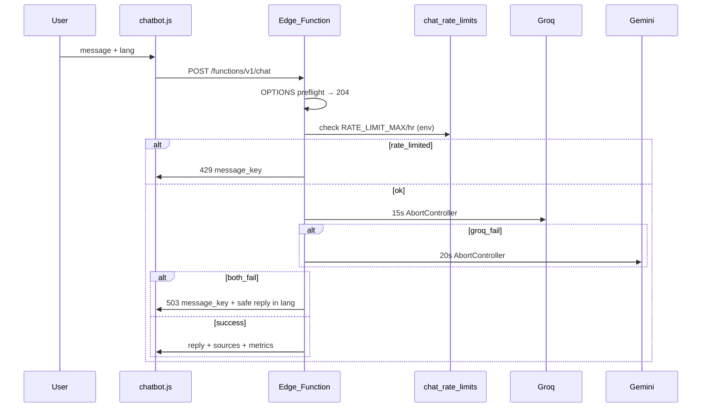

# Chatbot Integration Plan — APPROVED Final (v4.0)

**Score: 9.6/10 — Approved for implementation**

Five review cycles completed. Fixes applied from v3.2 review.

| Version | Score | Status |
|---------|-------|--------|
| v1 | 8.5 | Initial |
| v2 | 8.9 | DB rate limit + tiered RAG |
| v3 | 9.2 | Mandatory FTS + warm-up tests |
| v3.1 | 9.3 | Graceful dual-LLM failure + cron |
| v3.2 | 9.4 | Safe fallback reply + ops fallbacks documented |
| **v4.0 (APPROVED)** | **9.6** | **CJK token fix, CORS preflight, env-driven rate limit, Thai fix, staging-first deploy, i18n sync CI, history guard, SEO rollback plan** |

---

## Context

Static vanilla HTML/JS site ([index.html](index.html)) on GitHub Pages / Apache.

Reuse:

- **Supabase**: `hotnews`, `market_summary_stock`, `market_summary_macro`, `market_summary_macro_world`, `mul_lang_headline`
- **i18n**: [i18n.json](i18n.json) — `vi`, `en`, `ko`, `zh`, `th`, `ar`, `ja`
- **Language**: cookie `selectedLanguage` + `applyTranslations(lang)`
- **Headline join**: `event_id` + `lang_code` ([index.html](index.html) ~line 1883)
- **Snippet pattern**: follows existing [copy-link-snippet.mjs](scripts/copy-link-snippet.mjs) + [lang-menu-snippet.mjs](scripts/lang-menu-snippet.mjs) — export named constants; digest generators `import` and inline into HTML

API keys server-side only → Supabase Edge Function.



---

## Architecture

| Layer | Files | Responsibility |
|-------|-------|----------------|
| **DB migration** | `supabase/migrations/YYYYMMDD_chat_setup.sql` | Rate limits, FTS, cron (with fallbacks) |
| **Edge Function** | `supabase/functions/chat/*.ts` (7 modules) | Full pipeline; never crashes |
| **Frontend** | `chatbot.js`, `chatbot.css` | Widget; i18n via `message_key` |
| **i18n** | [i18n.json](i18n.json) | UI + error strings × 7 langs |
| **SEO embed** | `scripts/chatbot-snippet.mjs` | **BLOCKER** for full site coverage |

---

## Phase 1 — Database migration (Step 1)

File: `supabase/migrations/YYYYMMDD_chat_setup.sql`

Add a comment at the top documenting which cron option is active:

```sql
-- Chatbot setup migration
-- Cron option active: [A | B | C] — update this comment after deploy
```

### 1.1 Table `chat_rate_limits`

Rate limit controlled by `RATE_LIMIT_MAX` env var (default 30) read in Edge Function — **not hardcoded in SQL**. The SQL only stores and increments counts; the threshold check is in `rate-limit.ts`.

```sql
CREATE TABLE chat_rate_limits (
  ip_hash         TEXT NOT NULL,
  window_start    TIMESTAMPTZ NOT NULL,
  request_count   INT NOT NULL DEFAULT 1,
  last_request_at TIMESTAMPTZ NOT NULL DEFAULT now(),
  PRIMARY KEY (ip_hash, window_start)
);
CREATE INDEX idx_chat_rate_limits_window ON chat_rate_limits (window_start);
CREATE INDEX idx_chat_rate_limits_last   ON chat_rate_limits (last_request_at);
```

> **Design note**: `RATE_LIMIT_MAX` lives in Edge Function env — changing it requires only a secret update, not a DB migration. The DB stores raw counts; only `rate-limit.ts` decides what "too many" means.

### 1.2 Mandatory FTS on `hotnews`

```sql
ALTER TABLE hotnews ADD COLUMN IF NOT EXISTS headline_tsv tsvector
  GENERATED ALWAYS AS (
    to_tsvector('simple', coalesce(headline,'') || ' ' || coalesce(quote_50_word,''))
  ) STORED;
CREATE INDEX IF NOT EXISTS idx_hotnews_headline_tsv ON hotnews USING GIN (headline_tsv);
CREATE INDEX IF NOT EXISTS idx_hotnews_ticker_date ON hotnews (single_stock, publish_time DESC)
  WHERE match_method = 'TICKER';

CREATE OR REPLACE FUNCTION search_hotnews_fts(query_text TEXT, days_back INT DEFAULT 7, row_limit INT DEFAULT 8)
RETURNS SETOF hotnews LANGUAGE sql STABLE AS $$
  SELECT * FROM hotnews WHERE match_method = 'TICKER'
    AND publish_time >= now() - (days_back || ' days')::interval
    AND headline_tsv @@ plainto_tsquery('simple', query_text)
  ORDER BY news_impact_score DESC NULLS LAST LIMIT row_limit;
$$;
```

Verify: `SELECT * FROM search_hotnews_fts('VIC', 7, 5);`

> **GIN index build note**: On first deploy the GIN index may still be building (CONCURRENTLY). `rag.ts` must wrap the FTS tier in a try/catch — on error, skip FTS tier and continue with digest + fallback tiers gracefully.

### 1.3 Cleanup cron — three fallback options

**Always create the cleanup RPC** (required for Option B and useful for manual Option C):

```sql
CREATE OR REPLACE FUNCTION cleanup_chat_rate_limits() RETURNS void LANGUAGE sql AS $$
  DELETE FROM chat_rate_limits WHERE window_start < now() - interval '48 hours';
$$;
```

**Option A (preferred): Supabase pg_cron**

```sql
SELECT cron.schedule('cleanup-chat-rate-limits', '0 3 * * *',
  $$DELETE FROM chat_rate_limits WHERE window_start < now() - interval '48 hours'$$);
```

Enable: Supabase Dashboard → Database → Extensions → `pg_cron`.

**Option B: GitHub Actions** (if pg_cron unavailable)

Add weekly step to [.github/workflows/update-sitemap.yml](.github/workflows/update-sitemap.yml):

```yaml
- name: Cleanup chat rate limits
  run: |
    curl -X POST "${SUPABASE_URL}/rest/v1/rpc/cleanup_chat_rate_limits" \
      -H "apikey: ${SUPABASE_SERVICE_ROLE_KEY}" \
      -H "Authorization: Bearer ${SUPABASE_SERVICE_ROLE_KEY}"
```

**Option C: Manual** — run cleanup SQL monthly in Supabase SQL Editor.

Document which option is active in the comment at top of migration file.

---

## Phase 2 — Edge Function (Step 2)

### 2.1 Modules

```
supabase/functions/chat/
  index.ts          # handler; OPTIONS preflight; top-level try/catch; never crash
  sanitize.ts       # strip HTML, javascript:, control chars; max 500 chars; max history turns
  rate-limit.ts     # reads RATE_LIMIT_MAX from env; threshold check here (not SQL)
  rag.ts            # tiered RAG; FTS tier wrapped in try/catch (GIN build guard)
  token-budget.ts   # estimateTokens() CJK-aware, exported at top
  prompts.ts        # BASE_RULES + LANG_INSTRUCTIONS + FALLBACK_REPLIES map
  providers.ts      # Groq (15s) → Gemini (20s) via AbortController
```

### 2.2 Secrets & env

| Secret / Env | Default | Notes |
|--------------|---------|-------|
| `GROQ_API_KEY` | — | Primary |
| `GEMINI_API_KEY` | — | Fallback |
| `SUPABASE_SERVICE_ROLE_KEY` | — | DB + rate limit |
| `SUPABASE_URL` | — | Project URL |
| `ALLOWED_ORIGINS` | site URL | CORS — comma-separated list |
| `RATE_LIMIT_SALT` | — | See salt policy below |
| `RATE_LIMIT_MAX` | `30` | req/hour/IP — **Edge Function reads this; not in SQL** |
| `GROQ_TIMEOUT_MS` | `15000` | |
| `GEMINI_TIMEOUT_MS` | `20000` | |
| `CONTEXT_TOKEN_BUDGET` | `3500` | Relative to Groq Llama3-8b (8192 tok ctx); revisit if model changes |

#### `RATE_LIMIT_SALT` policy

```bash
openssl rand -base64 32   # generate once
```

| Rule | Detail |
|------|--------|
| Length | 32+ random characters |
| Storage | Supabase Edge Function Secrets only — **never commit to git** |
| Rotation | **Only rotate if compromised** (leak suspected) |
| Side effect of rotation | All existing `ip_hash` values invalidate → rate counters reset (acceptable) |
| Do NOT rotate | On routine deploys or key rollovers for Groq/Gemini |

### 2.3 CORS preflight (`index.ts`)

Handle `OPTIONS` before any business logic:

```typescript
// index.ts — top of handler, before any other logic
if (req.method === 'OPTIONS') {
  return new Response(null, {
    status: 204,
    headers: {
      'Access-Control-Allow-Origin': getAllowedOrigin(req, Deno.env.get('ALLOWED_ORIGINS') ?? ''),
      'Access-Control-Allow-Methods': 'POST, OPTIONS',
      'Access-Control-Allow-Headers': 'Content-Type, Authorization',
      'Access-Control-Max-Age': '86400',
    },
  });
}
```

`getAllowedOrigin()` checks request `Origin` header against `ALLOWED_ORIGINS` comma-separated list; returns matched origin or first entry as default.

### 2.4 Input sanitization (`sanitize.ts`)

- Strip HTML tags, `javascript:` URIs, control characters
- Max message length: **500 characters**
- Validate `lang` is one of: `['vi','en','ko','zh','th','ar','ja']`
- Max history turns: **10 turns** (20 messages). Truncate oldest first if exceeded.
- Max history token budget: **1000 tokens** (via `estimateTokens()`). Truncate oldest first.

```typescript
export const MAX_MESSAGE_LENGTH = 500;
export const MAX_HISTORY_TURNS = 10;
export const MAX_HISTORY_TOKENS = 1000;
export const VALID_LANGS = ['vi','en','ko','zh','th','ar','ja'] as const;
```

### 2.5 API contract

**Success (200):**

```json
{
  "reply": "...",
  "provider": "groq",
  "fallback_reason": null,
  "latency_ms": 1240,
  "context_tokens_used": 2180,
  "sources": [...]
}
```

**Errors — always include `message_key`:**

| HTTP | Body |
|------|------|
| 429 | `{ "error": "rate_limited", "message_key": "chatbot.rateLimited" }` |
| 400 | `{ "error": "invalid_input", "message_key": "chatbot.error" }` |
| 403 | `{ "error": "forbidden_origin", "message_key": "chatbot.error" }` |
| **503** | `{ "error": "llm_unavailable", "message_key": "chatbot.busy", "reply": "<safe default in lang>", "provider": null, "fallback_reason": "gemini_error" }` |

**Dual-LLM failure — two-layer response:**

1. `message_key: chatbot.busy` — frontend resolves via i18n (primary display path)
2. `reply` — **safe hardcoded fallback** in user's `lang` from `FALLBACK_REPLIES` map in `prompts.ts` — ensures widget shows text even if i18n not loaded (SEO static pages, race conditions)

```typescript
// prompts.ts
// NOTE: These strings MUST stay in sync with chatbot.busy in i18n.json.
// CI check: scripts/check-fallback-sync.mjs validates this at build time.
export const FALLBACK_REPLIES: Record<string, string> = {
  vi: 'Hệ thống đang bận. Vui lòng thử lại sau vài phút.',
  en: 'The system is busy. Please try again in a few minutes.',
  ko: '시스템이 busy 상태입니다. 잠시 후 다시 시도해 주세요.',
  zh: '系統繁忙，請稍後再試。',
  th: 'ระบบกำลังยุ่ง กรุณาลองใหม่ในอีกสักครู่',   // pure Thai — no English "busy"
  ar: 'النظام مشغول. يرجى المحاولة مرة أخرى بعد بضع دقائق.',
  ja: 'システムが混み合っています。数分後に再度お試しください。',
};
```

> **i18n sync rule**: `chatbot.busy[lang]` in [i18n.json](i18n.json) **must exactly match** `FALLBACK_REPLIES[lang]`. Enforced by `scripts/check-fallback-sync.mjs` (see Phase 5.1).

Frontend on 503: `showMessage(body.reply || i18n[lang][body.message_key])`.

Edge Function wrapped in top-level try/catch — **never returns 500 stack trace**.

### 2.6 LLM providers (`providers.ts`)

Groq 15s → Gemini 20s via `AbortController`. Log `fallback_reason` on switch.

`CONTEXT_TOKEN_BUDGET` default `3500` is calibrated for **Groq Llama3-8b** (8192-token context window). If the model is changed, update `CONTEXT_TOKEN_BUDGET` accordingly.

### 2.7 RAG — tiered (priority 100 > 80 > 60 > 20)

1. Exact ticker match (`hotnews`, 7 days, by impact) — priority 100
2. FTS via `search_hotnews_fts()` if tier 1 < 3 hits — priority 80 — **wrapped in try/catch; skip on error**
3. Digest keyword match (`market_summary_*`, 3 days) — priority 60
4. Top 3 high-impact fallback headlines — priority 20

**Batch `mul_lang_headline`:** one query per request — collect `event_id`s → `in.(...)` → Map lookup. Zero N+1.

### 2.8 Token budget (`token-budget.ts`)

**Export `estimateTokens()` at top of file** — single source of truth. **CJK-aware heuristic:**

```typescript
/**
 * v1 HEURISTIC — not exact token count.
 *
 * Approximation rationale:
 *   - Latin text: ~4 characters ≈ 1 token (standard GPT rule of thumb)
 *   - CJK characters (Chinese/Japanese/Korean): ~1–2 characters ≈ 1 token
 *     Using length/2 for CJK to avoid severely under-filling the context budget.
 *
 * Detection: Unicode ranges U+3000–U+9FFF, U+AC00–U+D7AF (Hangul), U+F900–U+FAFF
 * If >30% of characters are CJK, use the CJK heuristic.
 *
 * v2: replace with gpt-tokenizer or provider count API.
 */
export function estimateTokens(text: string): number {
  const cjkCount = (text.match(/[\u3000-\u9FFF\uAC00-\uD7AF\uF900-\uFAFF]/g) ?? []).length;
  const isCJKDominant = cjkCount / text.length > 0.3;
  return Math.ceil(text.length / (isCJKDominant ? 2 : 4));
}

/**
 * Priority when budget is tight (highest kept first):
 *   ticker (100) > fts (80) > digest (60) > fallback (20)
 * Rationale: "VIC" queries need VIC news before generic digests.
 */
export function trimContext(chunks: ContextChunk[], budget = 3500) {
  const sorted = [...chunks].sort((a, b) => b.priority - a.priority);
  let used = 0;
  const kept: ContextChunk[] = [];
  for (const chunk of sorted) {
    const est = estimateTokens(chunk.text);
    if (used + est > budget) continue;
    kept.push(chunk);
    used += est;
  }
  return { text: formatContextBlock(kept), tokensUsed: used };
}
```

### 2.9 Prompts (`prompts.ts`)

Base anti-hallucination rules + per-lang reply instruction.

**BASE_RULES:**

```
You are the AI assistant for Tin Tức Chứng Khoán 24h (tintucchungkhoan24h.com).
RULES:
1. Answer ONLY using the CONTEXT block below.
2. If CONTEXT lacks information, clearly state you don't have enough recent news data.
3. NEVER invent stock prices, percentages, or dates not in CONTEXT.
4. ALWAYS cite at least one source headline and date for factual answers.
5. End with a one-line disclaimer: this is not investment advice.
6. Keep answers under 200 words unless the user asks for more detail.
```

**LANG_INSTRUCTIONS:**

| lang | Reply language rule |
|------|---------------------|
| vi | Trả lời hoàn toàn bằng tiếng Việt. |
| en | Reply entirely in English. |
| ko | 한국어로만 답변하세요. |
| zh | 請使用繁體中文回答。 |
| th | ตอบเป็นภาษาไทยเท่านั้น |
| ar | أجب باللغة العربية فقط. |
| ja | 日本語のみで回答してください。 |

### 2.10 Logging

Log: `ip_hash`, `lang`, `message_length`, `provider`, `fallback_reason`, `latency_ms`, `context_tokens_used`, `source_count`, `rate_limit_remaining`. No raw IP, no message content.

---

## Phase 3 — Frontend (Step 4)

- `message_key` resolution for all errors
- On 503: prefer `body.reply` (safe fallback), else i18n `[message_key]`
- Per-lang `sessionStorage`: `chat_history_{lang}`
- Clear chat, source chips, RTL (`dir=rtl` for `ar`), disclaimer footer
- **Max history guard**: trim `chat_history_{lang}` to 10 turns on read; prevent unbounded growth
- Integrate in [index.html](index.html): `chatbot.css`, `chatbot.js` in `loadScripts()`, `CHAT_API_URL`

---

## Phase 4 — i18n (Step 4, alongside frontend)

All keys in [i18n.json](i18n.json) for 7 langs:

`toggleLabel`, `title`, `welcome`, `placeholder`, `send`, `thinking`, `error`, `rateLimited`, **`busy`**, `disclaimer`, `sources`, `retry`, `clear`, `noData`

> **Sync constraint**: `chatbot.busy[lang]` text **must exactly match** `FALLBACK_REPLIES[lang]` in `prompts.ts`.  
> Verified by CI check `scripts/check-fallback-sync.mjs` (see Phase 5.1).

---

## Phase 5 — SEO snippet (Step 6 — BLOCKER)

Without this, digest/article pages have **no chatbot**.

### 5.1 CI sync check — `scripts/check-fallback-sync.mjs`

Create this first (no external deps):

```javascript
// scripts/check-fallback-sync.mjs
// Validates that i18n.json chatbot.busy matches prompts.ts FALLBACK_REPLIES.
// Run: node scripts/check-fallback-sync.mjs
// Called by: npm run check (add to package.json scripts)
import fs from 'fs';
// Reads i18n.json + extracts chatbot.busy per lang
// Reads supabase/functions/chat/prompts.ts + parses FALLBACK_REPLIES
// Diffs — exits 1 if mismatch found, prints which langs differ
```

Add to `package.json`:
```json
"scripts": {
  "check": "node scripts/check-fallback-sync.mjs"
}
```

Add to GitHub Actions (e.g., on PR):
```yaml
- name: Check fallback sync
  run: npm run check
```

### 5.2 Chatbot snippet — `scripts/chatbot-snippet.mjs`

Follows the same pattern as [copy-link-snippet.mjs](scripts/copy-link-snippet.mjs) and [lang-menu-snippet.mjs](scripts/lang-menu-snippet.mjs): exports named constants that digest generators import and inline into `<script>` / `<style>` tags.

```javascript
// scripts/chatbot-snippet.mjs
export const CHATBOT_CSS = `/* chatbot widget styles — inlined into digest pages */`;
export const CHATBOT_SCRIPT = `/* chatbot widget JS — inlined into digest pages */`;
```

### 5.3 Wire into all 3 digest generators

All three follow the identical import + inline pattern. Add to each:

**[generate-digest.mjs](scripts/generate-digest.mjs)** (stock digest — hub + spoke pages):
```javascript
import { CHATBOT_CSS, CHATBOT_SCRIPT } from './chatbot-snippet.mjs';
// Inject ${CHATBOT_CSS} into <style> and ${CHATBOT_SCRIPT} into <script> in generatePage() + generateSpokePage()
```

**[generate-digest-macro.mjs](scripts/generate-digest-macro.mjs)** (macro digest):
```javascript
import { CHATBOT_CSS, CHATBOT_SCRIPT } from './chatbot-snippet.mjs';
// Inject into both hub (line ~396 CSS, ~675 JS) and spoke (line ~838 CSS, ~974 JS)
```

**[generate-world-news.mjs](scripts/generate-world-news.mjs)** (world news):
```javascript
import { CHATBOT_CSS, CHATBOT_SCRIPT } from './chatbot-snippet.mjs';
// Inject at same positions as copy-link and lang-menu snippets
```

### 5.4 Rollback plan (SEO snippet)

Before regenerating all digest pages:

1. **Dry-run**: `node scripts/generate-digest.mjs --dry-run` (or `--sample`) — verify HTML output contains chatbot widget without writing files
2. **Snapshot**: `git stash` or commit current digest pages before regeneration
3. **Selective rollback**: if faulty, revert the 3 generator imports + `git checkout -- diem-tin-chung-khoan/ tin-tuc-vi-mo/ tin-tuc-the-gioi/`
4. **Feature flag**: `CHATBOT_ENABLED=false` env var in snippet exports empty strings — allows toggling off without code changes

---

## Phase 6 — Deploy (Step 3) — Staging first

### 6.1 Staging deploy

1. `supabase db push` — to staging project
2. Verify FTS: `SELECT * FROM search_hotnews_fts('VIC', 7, 5);`
3. Set all secrets on staging (use non-production API keys where possible)
4. Enable cron (Option A/B/C — document choice in migration file comment)
5. `supabase functions deploy chat --no-verify-jwt` — to staging

> **`--no-verify-jwt` rationale**: chatbot is a public endpoint (no user auth required). Confirm this is intentional before prod deploy.

6. Run warm-up suite (8 tests) against staging URL
7. Frontend commit pointed at staging `CHAT_API_URL` — verify all 7 langs

### 6.2 Production promote

Only after staging warm-up passes:

1. `supabase db push` — prod
2. Set secrets on prod (`RATE_LIMIT_SALT` — use same value as staging unless rotating)
3. `supabase functions deploy chat --no-verify-jwt` — prod
4. Update `CHAT_API_URL` to prod URL
5. Regenerate digest pages (after dry-run, see Phase 5.4)
6. Commit + push

---

## Phase 7 — Testing

| # | Test | Expected |
|---|------|----------|
| 1 | VIC / vi | Sources + ticker tier |
| 2 | Fed rate / en | Digest context |
| 3 | Unknown ticker | No invented prices |
| 4–5 | 31 requests | 30 OK, 31st `429` |
| 6 | Both LLM keys broken | `503`, `message_key` + `reply` in lang, no crash |
| 7 | `<script>` in input | Sanitized |
| 8 | VIC / ko | Korean reply |
| 9 | `OPTIONS` preflight | `204` + correct CORS headers |
| 10 | 11-turn history | Oldest turn truncated; no overflow |
| 11 | CJK message (zh/ko/ja) | Token estimate reasonable; context not under-filled |
| 12 | SEO page (digest) | Chatbot widget present + functional |

Plus: 7 langs, RTL (ar), mobile, SEO pages, lang-switch history.

---

## Execution order (Option E — Backend first, Staging-gated)

| Step | Task | Notes |
|------|------|-------|
| **1** | Migration SQL | Option A/B/C — document in file |
| **D** | System prompts (7 langs) in `prompts.ts` | Can do in parallel with Step 1 |
| **2** | Edge Function (7 modules) | CORS preflight + CJK token + env rate limit |
| **3** | Staging deploy + warm-up suite | Gate — do NOT proceed to Step 4 if any test fails |
| **4** | Frontend + i18n | Run `npm run check` (fallback sync) before commit |
| **5** | `index.html` integration + 7-lang test | |
| **6** | CI check + SEO snippet dry-run + regenerate | Dry-run first; snapshot before regenerate |
| **7** | Production promote | |
| **8** | Full QA | Mobile, RTL, rate limit UX, all 12 test cases |

---

## Files to create / modify

| Action | File |
|--------|------|
| Create | `supabase/migrations/YYYYMMDD_chat_setup.sql` |
| Create | `supabase/functions/chat/` — 7 modules |
| Create | `chatbot.js`, `chatbot.css` |
| Create | `scripts/chatbot-snippet.mjs` |
| Create | `scripts/check-fallback-sync.mjs` |
| Modify | [i18n.json](i18n.json) — add `chatbot.*` keys × 7 langs |
| Modify | [index.html](index.html) — loadScripts + CHAT_API_URL |
| Modify | [scripts/generate-digest.mjs](scripts/generate-digest.mjs) |
| Modify | [scripts/generate-digest-macro.mjs](scripts/generate-digest-macro.mjs) |
| Modify | [scripts/generate-world-news.mjs](scripts/generate-world-news.mjs) |
| Modify (optional) | `.github/workflows/update-sitemap.yml` — cron Option B |
| Modify (optional) | `package.json` — add `check` script |

---

## Estimated effort: 2–4 days

**Final score: 9.6/10 — APPROVED for implementation**

---

## Fixes applied from v3.2 review

| # | Issue | Fix |
|---|-------|-----|
| 1 | `chatbot.busy` ↔ `FALLBACK_REPLIES` sync unenforceable | Added `check-fallback-sync.mjs` CI check |
| 2 | `RATE_LIMIT_MAX` hardcoded in SQL | Moved threshold check to `rate-limit.ts`; SQL only stores counts |
| 3 | SEO snippet no rollback plan | Added dry-run, git snapshot, feature flag, selective rollback |
| 4 | CJK token heuristic `length/4` over-estimates | CJK-aware `estimateTokens()`: CJK-dominant → `length/2` |
| 5 | History max turns/tokens unspecified | `MAX_HISTORY_TURNS=10`, `MAX_HISTORY_TOKENS=1000` in `sanitize.ts` |
| 6 | Missing CORS preflight | `OPTIONS → 204` handler at top of `index.ts` |
| 7 | FTS index not-yet-built guard missing | FTS tier wrapped in try/catch in `rag.ts`; skip on error |
| 8 | Thai `FALLBACK_REPLIES` mixed English "busy" | Fixed: `'ระบบกำลังยุ่ง กรุณาลองใหม่ในอีกสักครู่'` |
| 9 | `--no-verify-jwt` not explained | Added rationale comment in deploy step |
| 10 | `CONTEXT_TOKEN_BUDGET` not tied to model | Documented relative to Llama3-8b 8192-token context |
| 11 | No staging step between deploy and prod | Added staging-first deploy gate (Phase 6.1 → 6.2) |
| 12 | SEO snippet pattern not referenced | Explicitly references `copy-link-snippet.mjs` / `lang-menu-snippet.mjs` as pattern; identifies all 3 generators |
